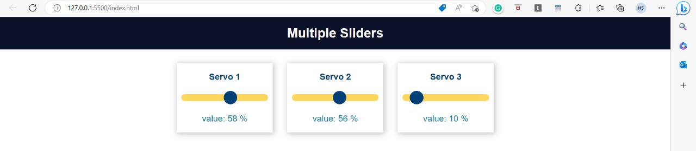
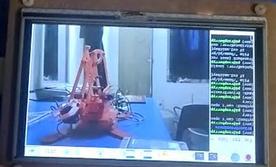

# robotic-arm # 

A robotic arm with 4 dof is controlled remotely with the help of esp32 webserver which is hosted locally.  

## What it does
We can control the robotic arm using the sliders and can be used for operations like pick and place. I have also integrated an Rpi with Rpi camera by which we can see the live feed of the camera as well.  

## Setup
- Get a 4dof robotic arm and assemble it with servo motors
- Connect the servos to the esp32 board
- Now, download the file <code> robotic_arm.ino </code> and install the libraries as mentioned in the code and make the connections of servo pins accordingly.
- The <code> data </code> folder holds the HTML, CSS and JS files for the webserver.
- Refer the following reference tutorial to upload the code to the board

## Reference
- The webserver is refered from the [Random nerd tutorials](https://randomnerdtutorials.com/esp32-web-server-websocket-sliders/)

## Webserver UI
Based on these sliders, the robotic arm can be controlled. 

## Camerafeed 
 

## Working
- The ESP hosts a web server that displays a web page with sliders.
- When you set a new position for a slider, the client sends the slider number and slider value to the server via WebSocket protocol
- The server (ESP) receives the slider number and corresponding value and adjusts the PWM duty cycle accordingly. Additionally, it also notifies all the other       clients with the new current slider values—this allows us to have all clients updated almost instantaneously.

## Contributions

- Feel Free to Open a PR/Issue for any feature or bug(s).
- Make sure to follow the [community guidelines](https://docs.github.com/en/github/site-policy/github-community-guidelines) when contributing.
- Please open an issue if you want to ask a question/discuss anything about Project.
- Want to add an action? add a feature? Open an Issue!

## License

Licensed under [MIT License](https://opensource.org/licenses/MIT)
